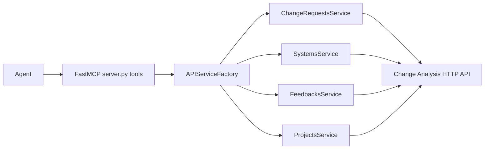

## Agent Tool Guide for Change Analysis MCP

This guide explains how AI agents can reliably use the MCP tools exposed by `server.py`.
All tools return **human-readable strings**, often with a **pretty-printed JSON payload**
appended at the end. Existing behavior is preserved for backward compatibility.

### General usage conventions

- **Transport**: Tools are exposed via FastMCP from `server.py`.
- **Return type**: Every tool returns a `str`, never a raw JSON object.
- **Success patterns**:
  - List tools: `"Found <N> <entity>(s): <JSON array>"`
  - Create/update/approve/reject tools: `"<Entity> ... successfully: <JSON object>"`
  - Delete tools: `"<Entity> <id> deleted successfully"`
  - Get-by-id tools: `<JSON object>` only (no leading text).
- **Error patterns**:
  - Validation: `"Error: <description>"`
  - HTTP errors: `"HTTP error occurred: <status> - <body>"`
  - Request errors: `"Request error occurred: <reason>"`
  - Other: `"Error <action> ...: 
"`

Agents can typically extract the JSON payload by locating the first `{` or `[` and
parsing from there, while checking the prefix to detect error states.

---

## Change request tools

These tools work with change requests via `ChangeRequestsService`.

### `analyze_change(change: str) -> str`

- **Purpose**: Quick keyword search across change requests using a free-text query.
- **Parameters**:
  - **change**: Required search phrase; must be non-empty. Trimmed before use.
- **Behavior**:
  - Fetches all change requests and applies client-side keyword matching over
    `key`, `title`, and `description`.
- **Returns**:
  - Success with matches:
    - `"Found <N> change request(s) for '<query>': <JSON array>"`
  - Success with no matches:
    - `"No change requests found for '<query>'"`
  - Errors follow the general error patterns.
- **Typical usage**:
  - Use when you have a short description or known key fragment and want to locate
    relevant change requests quickly.

### `list_change_requests(status, priority, department, assignee_id, search) -> str`

- **Purpose**: Primary listing endpoint for change requests with filters.
- **Parameters** (all optional, trimmed if provided):
  - **status**: e.g., `"open"`, `"in_progress"`, `"closed"`.
  - **priority**: e.g., `"low"`, `"medium"`, `"high"`.
  - **department**: Department/team identifier.
  - **assignee_id**: Assignee/owner identifier.
  - **search**: Free-text keyword applied client-side to `key`, `title`, and `description`.
- **Returns**:
  - `"Found <N> change request(s): <JSON array>"`
  - Errors follow the general error patterns.
- **When to use**:
  - Listing or filtering change requests by attributes and/or search phrase.

### `get_change_request(change_request_id: str) -> str`

- **Purpose**: Retrieve a single change request by ID.
- **Parameters**:
  - **change_request_id**: Required ID string; trimmed.
- **Returns**:
  - On success: `<JSON object>` for the change request (no leading text).
  - On error: `"Error: Change request ID cannot be empty"` or the general error patterns.

### `create_change_request(change_request_data: str) -> str`

- **Purpose**: Create a new change request.
- **Parameters**:
  - **change_request_data**: Required JSON string matching the API's change request schema.
- **Returns**:
  - Success: `"Change request created successfully: <JSON object>"`
  - Validation/JSON/API errors follow the general patterns.

### `update_change_request(change_request_id: str, update_data: str) -> str`

- **Purpose**: Partially update an existing change request.
- **Parameters**:
  - **change_request_id**: Required ID; trimmed.
  - **update_data**: Required JSON string with fields to update.
- **Returns**:
  - Success: `"Change request updated successfully: <JSON object>"`
  - Errors follow the general patterns.

### `delete_change_request(change_request_id: str) -> str`

- **Purpose**: Delete a change request by ID.
- **Parameters**:
  - **change_request_id**: Required ID; trimmed.
- **Returns**:
  - Success: `"Change request <id> deleted successfully"`
  - Errors follow the general patterns.

### `add_comment_to_change_request(change_request_id: str, comment_data: str) -> str`

- **Purpose**: Attach a comment to an existing change request.
- **Parameters**:
  - **change_request_id**: Required ID; trimmed.
  - **comment_data**: Required JSON string for the comment payload.
- **Returns**:
  - Success: `"Comment added successfully: <JSON object>"`
  - Errors follow the general patterns.

### `approve_change_request(change_request_id: str) -> str`

- **Purpose**: Approve a change request.
- **Parameters**:
  - **change_request_id**: Required ID; trimmed.
- **Returns**:
  - Success: `"Change request approved successfully: <JSON object>"`
  - Errors follow the general patterns.

### `reject_change_request(change_request_id: str) -> str`

- **Purpose**: Reject a change request.
- **Parameters**:
  - **change_request_id**: Required ID; trimmed.
- **Returns**:
  - Success: `"Change request rejected successfully: <JSON object>"`
  - Errors follow the general patterns.

---

## System tools

These tools work with systems via `SystemsService`.

### `list_systems(status, criticality, department, owner_id) -> str`

- **Purpose**: List systems with optional filters.
- **Parameters** (all optional, trimmed if provided):
  - **status**: System status.
  - **criticality**: e.g., `"low"`, `"medium",` `"high"`.
  - **department**: Department/team identifier.
  - **owner_id**: System owner identifier.
- **Returns**:
  - `"Found <N> system(s): <JSON array>"`
  - Errors follow the general patterns.

### `get_system(system_id: str) -> str`

- **Purpose**: Get a specific system by ID.
- **Parameters**:
  - **system_id**: Required ID; trimmed.
- **Returns**:
  - On success: `<JSON object>` for the system.
  - Errors follow the general patterns.

### `create_system(system_data: str) -> str`

- **Purpose**: Create a new system.
- **Parameters**:
  - **system_data**: Required JSON string describing the system.
- **Returns**:
  - `"System created successfully: <JSON object>"`
  - Errors follow the general patterns.

### `update_system(system_id: str, update_data: str) -> str`

- **Purpose**: Update an existing system.
- **Parameters**:
  - **system_id**: Required ID; trimmed.
  - **update_data**: Required JSON string with fields to update.
- **Returns**:
  - `"System updated successfully: <JSON object>"`
  - Errors follow the general patterns.

### `delete_system(system_id: str) -> str`

- **Purpose**: Delete a system by ID.
- **Parameters**:
  - **system_id**: Required ID; trimmed.
- **Returns**:
  - `"System <id> deleted successfully"`
  - Errors follow the general patterns.

---

## Feedback tools

These tools work with feedback entries via `FeedbacksService`.

### `list_feedbacks(status, category, priority, source_system) -> str`

- **Purpose**: List feedback entries with filters.
- **Parameters** (all optional, trimmed if provided):
  - **status**: Feedback status.
  - **category**: Category label.
  - **priority**: e.g., `"low"`, `"medium"`, `"high"`.
  - **source_system**: Identifier of the source system.
- **Returns**:
  - `"Found <N> feedback(s): <JSON array>"`
  - Errors follow the general patterns.

### `get_feedback(feedback_id: str) -> str`

- **Purpose**: Get a single feedback entry by ID.
- **Parameters**:
  - **feedback_id**: Required ID; trimmed.
- **Returns**:
  - On success: `<JSON object>` for the feedback.
  - Errors follow the general patterns.

### `create_feedback(feedback_data: str) -> str`

- **Purpose**: Create a new feedback entry.
- **Parameters**:
  - **feedback_data**: Required JSON string describing the feedback.
- **Returns**:
  - `"Feedback created successfully: <JSON object>"`
  - Errors follow the general patterns.

### `update_feedback(feedback_id: str, update_data: str) -> str`

- **Purpose**: Update an existing feedback entry.
- **Parameters**:
  - **feedback_id**: Required ID; trimmed.
  - **update_data**: Required JSON string with fields to update.
- **Returns**:
  - `"Feedback updated successfully: <JSON object>"`
  - Errors follow the general patterns.

### `delete_feedback(feedback_id: str) -> str`

- **Purpose**: Delete a feedback entry by ID.
- **Parameters**:
  - **feedback_id**: Required ID; trimmed.
- **Returns**:
  - `"Feedback <id> deleted successfully"`
  - Errors follow the general patterns.

---

## Project tools

These tools work with projects via `ProjectsService`.

### `list_projects(status, priority, department, project_manager_id) -> str`

- **Purpose**: List projects with filters.
- **Parameters** (all optional, trimmed if provided):
  - **status**: Project status.
  - **priority**: e.g., `"low"`, `"medium"`, `"high"`.
  - **department**: Department/team identifier.
  - **project_manager_id**: Project manager identifier.
- **Returns**:
  - `"Found <N> project(s): <JSON array>"`
  - Errors follow the general patterns.

### `get_project(project_id: str) -> str`

- **Purpose**: Get a specific project by ID.
- **Parameters**:
  - **project_id**: Required ID; trimmed.
- **Returns**:
  - On success: `<JSON object>` for the project.
  - Errors follow the general patterns.

### `create_project(project_data: str) -> str`

- **Purpose**: Create a new project.
- **Parameters**:
  - **project_data**: Required JSON string describing the project.
- **Returns**:
  - `"Project created successfully: <JSON object>"`
  - Errors follow the general patterns.

### `update_project(project_id: str, update_data: str) -> str`

- **Purpose**: Update an existing project.
- **Parameters**:
  - **project_id**: Required ID; trimmed.
  - **update_data**: Required JSON string with fields to update.
- **Returns**:
  - `"Project updated successfully: <JSON object>"`
  - Errors follow the general patterns.

### `delete_project(project_id: str) -> str`

- **Purpose**: Delete a project by ID.
- **Parameters**:
  - **project_id**: Required ID; trimmed.
- **Returns**:
  - `"Project <id> deleted successfully"`
  - Errors follow the general patterns.

---

## Health check tool

### `health_check() -> str`

- **Purpose**: Verify MCP server configuration and API connectivity.
- **Parameters**:
  - None.
- **Returns**:
  - Always a multi-line human-readable status string that contains a
    `"Configuration Status:"` section.
  - Typical forms:
    - `"Health check failed: API key not configured...."`
    - `"Health check passed: Server is operational and API connection is working...."`
    - `"Health check warning: API returned HTTP <status>..."`
    - `"Health check failed: Cannot connect to API - 
..."`

---

## How agents should parse results

- **1. Check for obvious error prefixes**:
  - If the string starts with `"Error: "`, `"HTTP error occurred:"`,
    `"Request error occurred:"`, `"Health check failed:"`, or
    `"Health check warning:"`, treat it as an error/warning and handle accordingly.
- **2. Extract JSON payloads on success**:
  - For list/create/update/approve/reject tools, locate the first `{` or `[` and parse
    the trailing substring as JSON when you need structured data.
  - For get-by-id tools, the entire string should be parseable as a JSON object.
- **3. Preserve human-readable text when useful**:
  - Upstream UIs or logs may want to display the full message while agents rely on the
    JSON portion for structured reasoning.

---

## Architecture overview

The following diagram shows how a typical call flows through the system:

Agents should expect network latency and HTTP-related failures from the `httpApi`
layer and validation errors from the MCP/tool layer.

